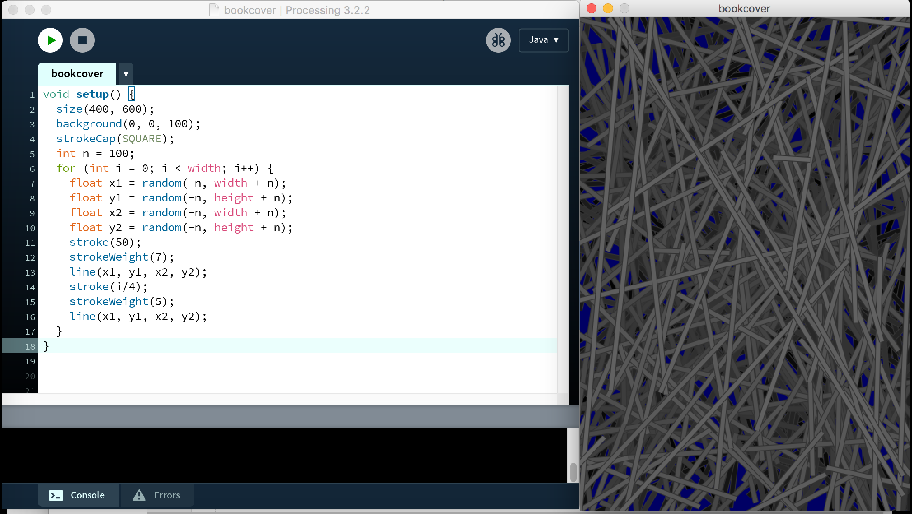

<!-- .slide: data-background="./assets/fondo01.jpg" -->

## **De arquitecta a programadora, ¡Processing al rescate!**

---

<!-- .slide: data-background="./assets/fondo03.jpg" -->

**Esperanza Moreno Cruz**

**twitter**: @\_mimina\_      
**github**: @mi-mina  
**mail**: hola@mi-mina.com

---

<!-- .slide: data-background="./assets/fondo02.jpg" -->

### **O...**
### **de la potencialidad de los entornos visuales e interactivos para el aprendizaje y la creación.**

---

meter imagen trayectoria profesional

---

<!-- .slide: data-background="./assets/fondo05.jpg" -->

---

<!-- .slide: data-background="./assets/fondo06.jpg" -->

**[Processing](https://processing.org/) es un proyecto free and open source que empezó en el MIT en 2001, creado por [Casey Reas](http://reas.com/) y [Ben Fry](http://benfry.com/), cuando ambos eran estudiantes en el grupo de investigación ‘Estética y computación’ de John Maeda.**

---

<!-- .slide: data-background="./assets/fondo06.jpg" -->

> "Processing es un software flexible para hacer bocetos y un lenguaje de programación para aprender a programar en el contexto de las artes visuales y la alfabetización visual en el ámbito de la tecnología"

---

<!-- .slide: data-background="./assets/fondo07.jpg" -->

---

<!-- .slide: data-background="./assets/fondo08.jpg" -->

<iframe src="https://www.openprocessing.org/" width="640" height="360" frameborder="0" style="position:absolute;width:100%;height:100%;left:0" allowfullscreen></iframe>

---

<!-- .slide: data-background="./assets/fondo08.jpg" -->

<iframe src="https://pingaprogramadoras.github.io/introP5/practica07/index.html" width="640" height="360" frameborder="0" style="position:absolute;width:100%;height:100%;left:0" allowfullscreen></iframe>

---
