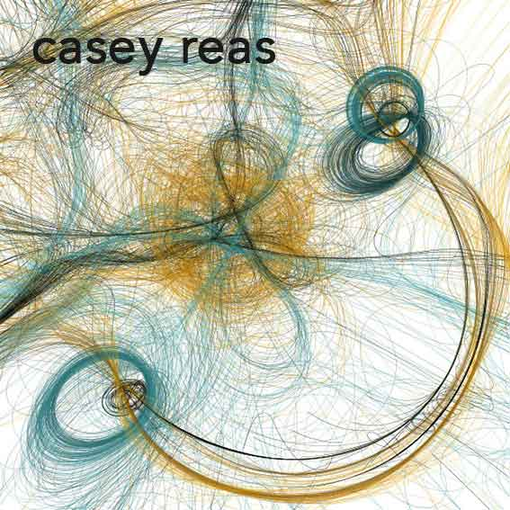
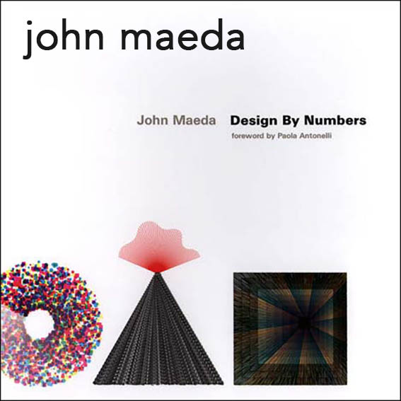

<!-- 0 -->
<!-- .slide: data-background="./assets/fondo01.jpg" -->

## **De arquitecta a programadora, ¡Processing al rescate!**

---

<!-- 1 -->
<!-- .slide: data-background="./assets/fondo03.jpg" -->

**Esperanza Moreno Cruz**

**twitter**: @\_mimina\_      
**github**: @mi-mina  
**mail**: hola@mi-mina.com  
https://mi-mina.github.io/2016-arquitectura-programacion

---

<!-- 2 -->
<!-- .slide: data-background="./assets/fondo02.jpg" -->

### **O...**
### **de la potencialidad de los entornos visuales e interactivos para el aprendizaje y la creación.**

---

<!-- 3 -->
meter imagen trabajo como arquitecta

---

<!-- 4 -->
meter imagen otras inquitudes

---

<!-- 5 -->
<!-- .slide: data-background="./assets/fondo05.jpg" -->

---

<!-- 5 -->
<!-- .slide: data-background="./assets/fondo06.jpg" -->

### **[Processing](https://processing.org/)**

---

<!-- .slide: data-background="./assets/fondo07.jpg" -->

---

<!-- .slide: data-background="./assets/fondo08.jpg" -->

  <iframe src="https://mi-mina.github.io/2017-ex-processing/paint/index.html" frameborder="0" style="position:absolute;width:100%;height:100%;left:25%" allowfullscreen>
  </iframe>

---

<!-- .slide: data-background="./assets/fondo08.jpg" -->

  <iframe src="https://www.openprocessing.org/" width="640" height="360" frameborder="0" style="position:absolute;width:100%;height:100%;left:0" allowfullscreen>
  </iframe>

---

<!-- .slide: data-background="./assets/fondo06.jpg" -->

> "Processing es un software flexible para hacer bocetos y un lenguaje de programación para aprender a programar en el contexto de las artes visuales y la alfabetización visual en el ámbito de la tecnología"

---

---
